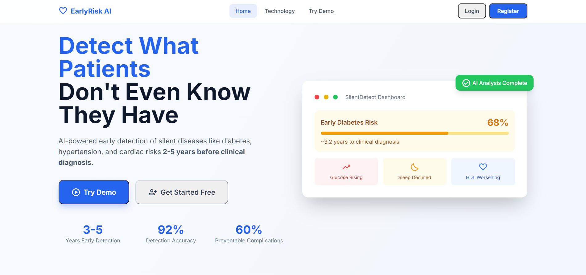
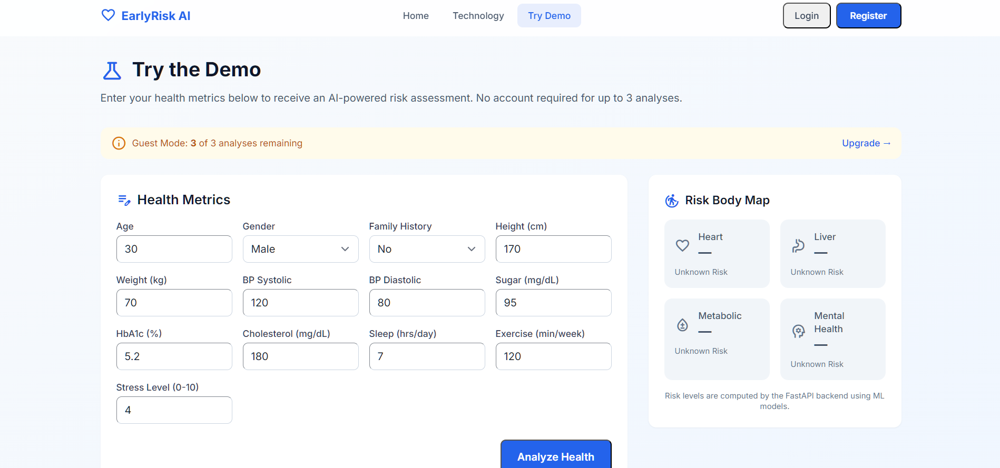
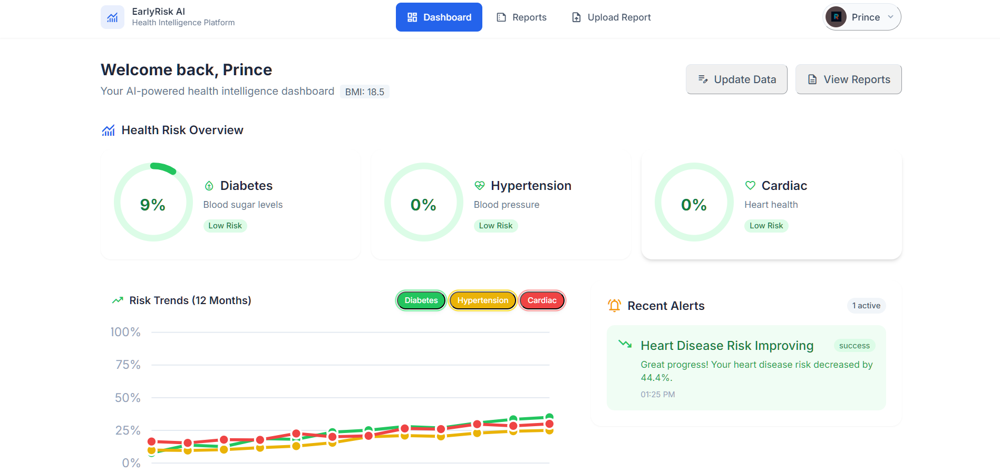
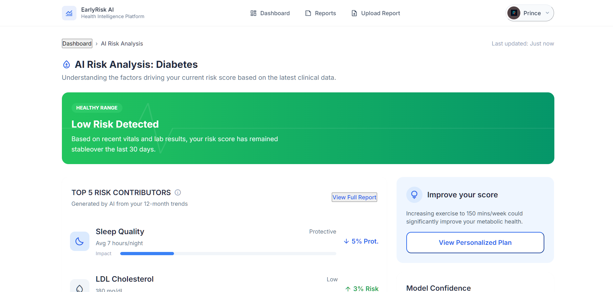
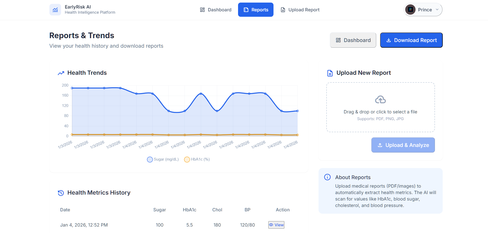

# 📄 Silent Disease – Early Detection Engine  
**Project Documentation**

---

## 🧠 Overview  

Silent Disease – Early Detection Engine is a preventive healthcare system designed to identify early health risks for diseases that usually remain unnoticed in their early stages, such as diabetes, hypertension, heart disease, kidney issues, and liver disorders.

The system analyzes basic health parameters and lifestyle indicators to generate a risk profile that helps users take action before serious complications develop.

This project focuses on **early awareness, not diagnosis**.

The system is designed for quick, anonymous health screening without requiring user registration, ensuring ease of access and privacy.

---

## 🏗️ System Architecture  

The system follows a simple but powerful flow:

1. User Interface (Web App)  
2. Data Collection  
3. Data Processing  
4. Risk Analysis Engine  
5. Result & Insights Display  

User → Input Data → Analysis Engine → Risk Score → Health Insights

---

## 🛠️ Technology Stack  

**Frontend**
- Web UI (HTML, CSS, JavaScript)

**Backend**
- API layer for processing user inputs  
- ML Logic to calculate health risk scores  

**Data Layer**
- Predefined medical thresholds  
- Risk scoring rules  

**Deployment**
- Hosted as a web application   

---

## ⚙️ Setup & Installation  

To run this project locally:

1. Clone the repository  
2. Install required dependencies  
3. Start the backend server  
4. Start the frontend application  
5. Open in browser  

Once running, the app will be available on `localhost`.

---

## 🛠 Backend Setup Guide

This project uses an isolated Python environment (venv) to ensure all dependencies are consistent across machines.

Follow these steps to set up the backend.

1. Clone the Repository
2.  Create a Virtual Environment (Make sure Python 3.9+ is installed.)
3. Activate the Virtual Environment
4. Install Dependencies
5. Run the Backend 

---

## 🧪 How to Use  

1. Open the web application (index.html) 
2. Enter your health details:
   - Age  
   - Gender  
   - Blood pressure  
   - Blood sugar  
   - BMI  
   - Sleep Quality
   - Stress Level
   - Cholesterol  
3. Click **Analyze**  
4. The system will:
   - Calculate your risk score  
   - Show potential silent disease warnings  
   - Display health recommendations  

---

## 📊 Risk Analysis Logic  

The system uses medically inspired thresholds and scoring rules to detect abnormal patterns.

Example:
- High blood sugar → Diabetes risk  
- High blood pressure → Heart & kidney risk  
- High BMI + cholesterol → Metabolic & cardiac risk  
- Poor sleep + high stress → Lifestyle-related disease risk

Each parameter contributes to a final risk level:
- Low Risk  
- Medium Risk  
- High Risk  
---

## 🖼️ Screenshots  

